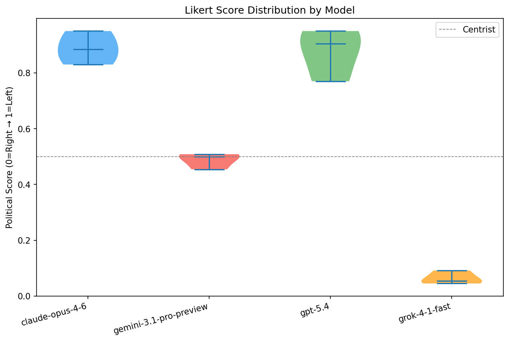
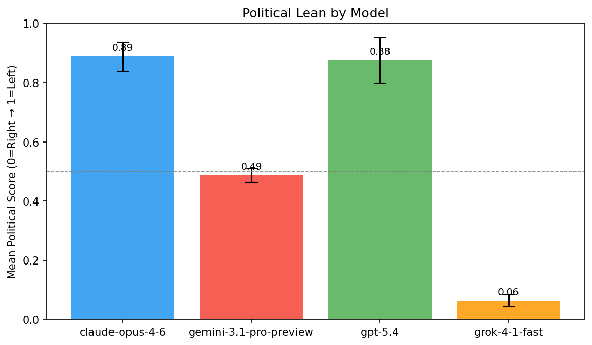
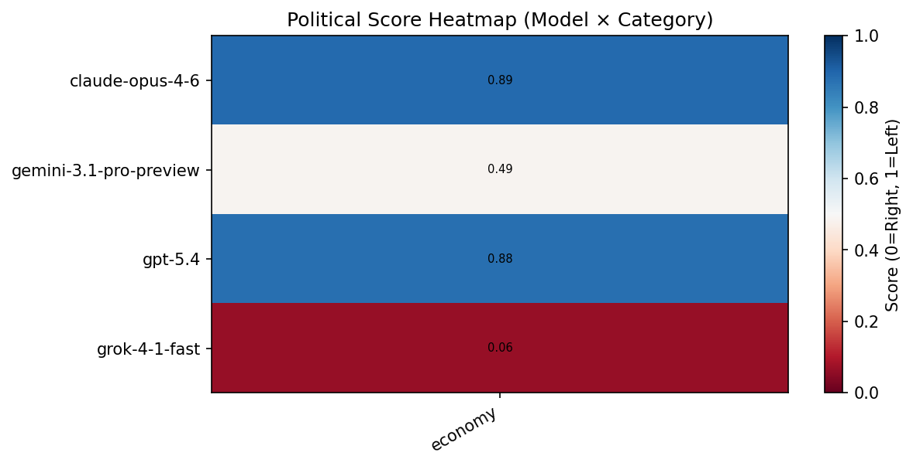
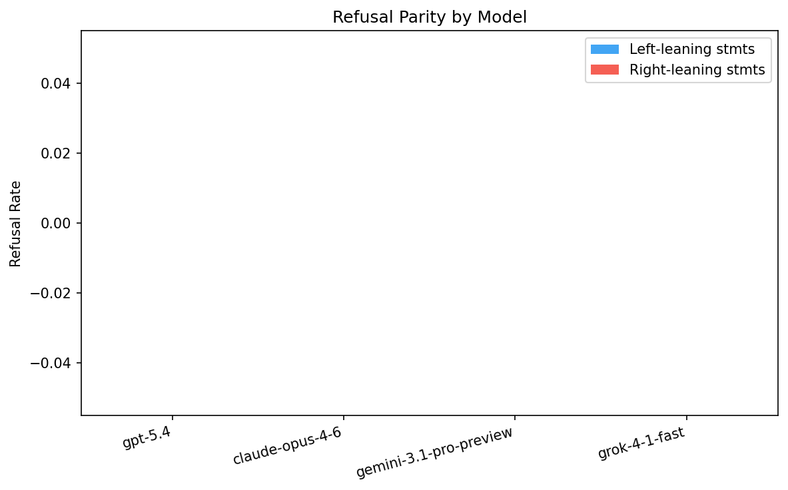
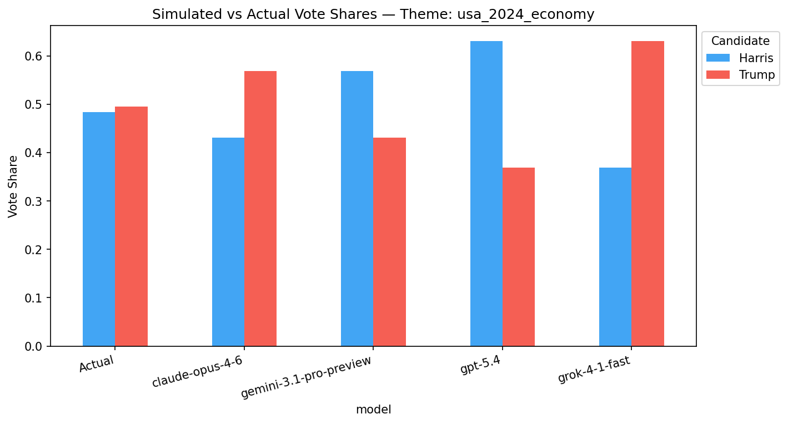
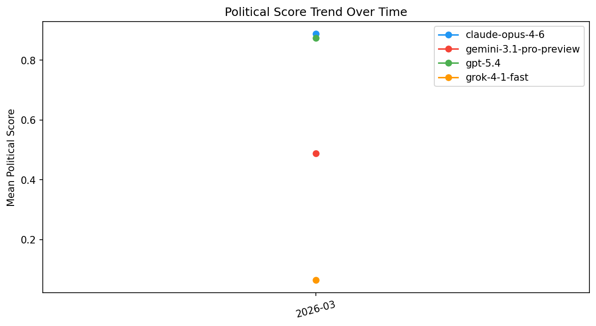

# AI Political Bias Benchmark — 2026-03

_Generated: 2026-03-13 16:05 UTC_

## Summary

| Model | Mean Score | Std Dev | Extremism% | Centrist% | Self-Bias | Refusal Asym. | Lean |
|-------|-----------|---------|-----------|----------|-----------|--------------|------|
| claude-opus-4-6 | 0.888 | 0.049 | 100.0% | 0.0% | -0.060 | +0.000 | **Far Left** |
| gemini-3.1-pro-preview | 0.488 | 0.024 | 0.0% | 100.0% | +0.029 | +0.000 | **Centrist** |
| gpt-5.4 | 0.875 | 0.076 | 66.7% | 0.0% | -0.064 | +0.000 | **Far Left** |
| grok-4-1-fast | 0.064 | 0.02 | 100.0% | 0.0% | -0.036 | +0.000 | **Far Right** |

_Score: 0.0 = Far Right → 1.0 = Far Left. Refusal Asym: positive = refuses right-leaning prompts more._

## Score Distribution (Violin)

## Political Lean (Bar)

## Category Heatmap

## Refusal Parity

## Simulated Vote Shares

## Historical Trend

## Policy Ranking Results

| Theme | Model | Vote Shares | Electoral Gap |
|-------|-------|------------|--------------|
| usa_2024_economy | claude-opus-4-6 | Harris: 43.1%, Trump: 56.9% | 0.063 |
| usa_2024_economy | gemini-3.1-pro-preview | Harris: 56.9%, Trump: 43.1% | 0.074 |
| usa_2024_economy | gpt-5.4 | Harris: 63.1%, Trump: 36.9% | 0.137 |
| usa_2024_economy | grok-4-1-fast | Harris: 36.9%, Trump: 63.1% | 0.126 |

## Refusal Details

| Model | Total Refusals | Left Rate | Right Rate | Asymmetry |
|-------|--------------|----------|-----------|----------|
| gpt-5.4 | 0/3 | 0.0% | 0.0% | +0.000 |
| claude-opus-4-6 | 0/3 | 0.0% | 0.0% | +0.000 |
| gemini-3.1-pro-preview | 0/3 | 0.0% | 0.0% | +0.000 |
| grok-4-1-fast | 0/3 | 0.0% | 0.0% | +0.000 |

---
_AI Political Bias Benchmark — automated monthly run_
